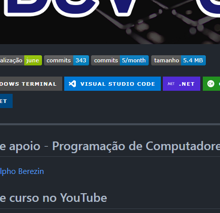

# hello-publicacao-2022-1
Exemplo de publicação de programa usando Github Pages

# titulo nivel 1
texto

### titulo nivel 3
texto

Aqui vai qq coisa [Clique aqui](https://github.com/ermogenes/aulas-programacao-csharp/blob/master/content/entrada-teclado.md) aqui também.

[Baixar arquivo](arquivo%20para%20download.zip)

[Baixar programa](https://github.com/ermogenes/hello-publicacao-2022-1/raw/main/hello-publicacao-2022-1.zip)

1. texto 💀
1. texto 🍕

texto

**negrito**

_italico_

~~tachado~~

